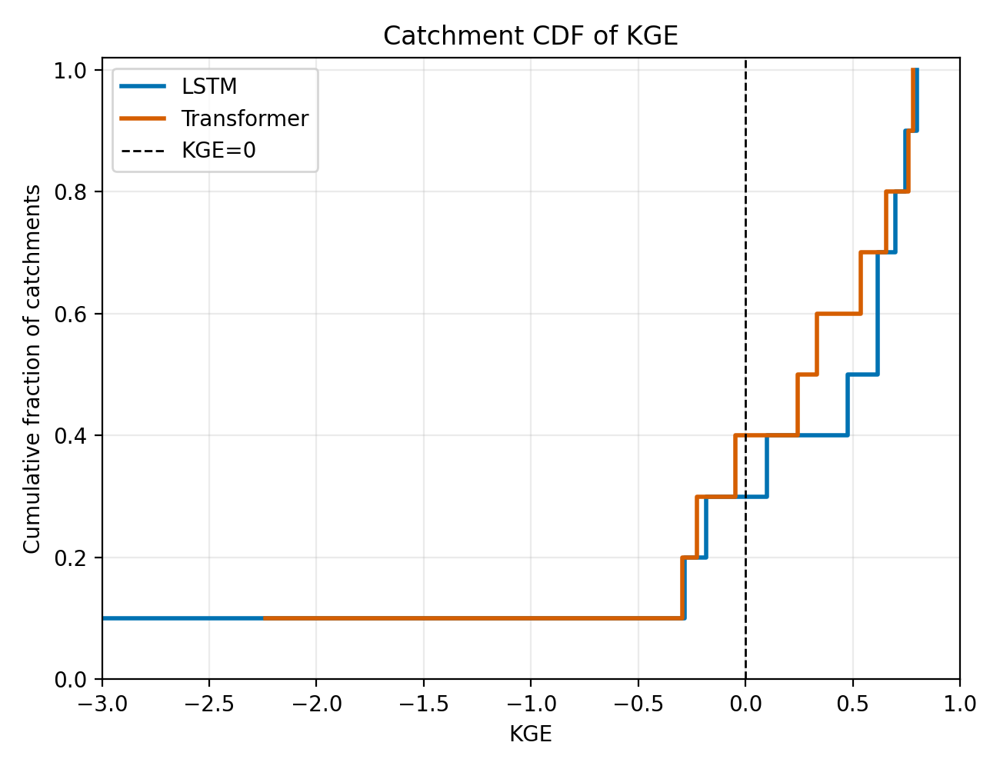
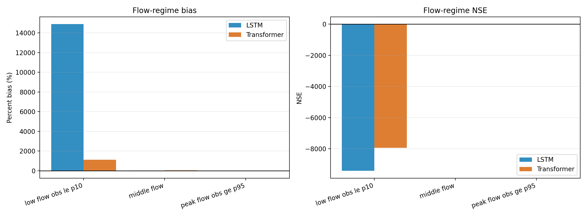
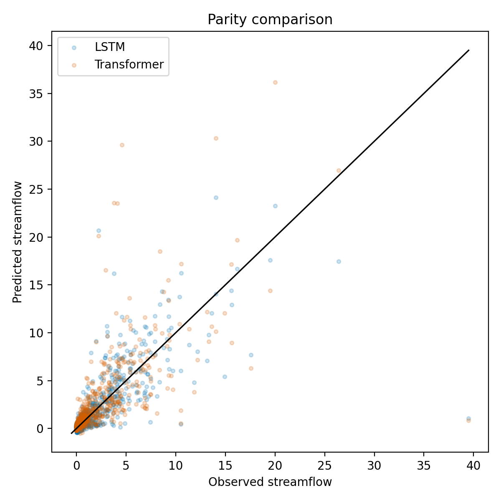
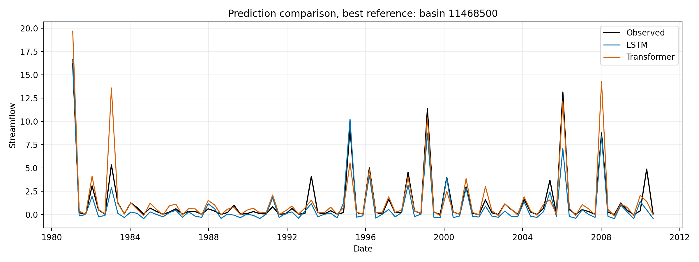
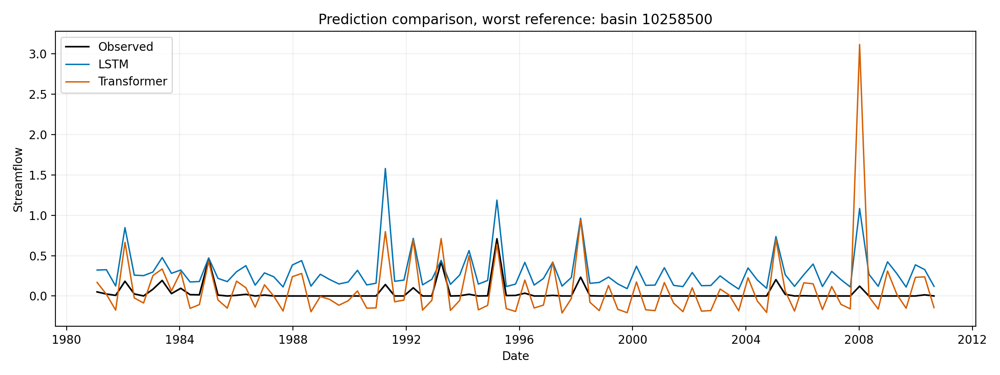
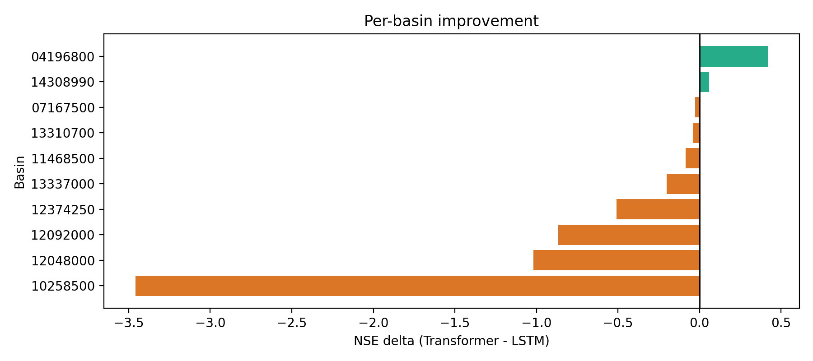
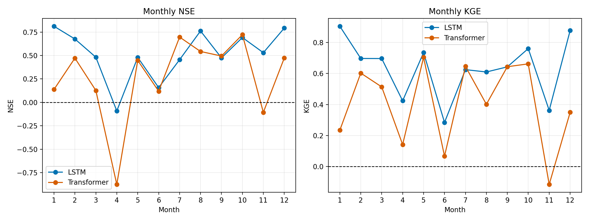
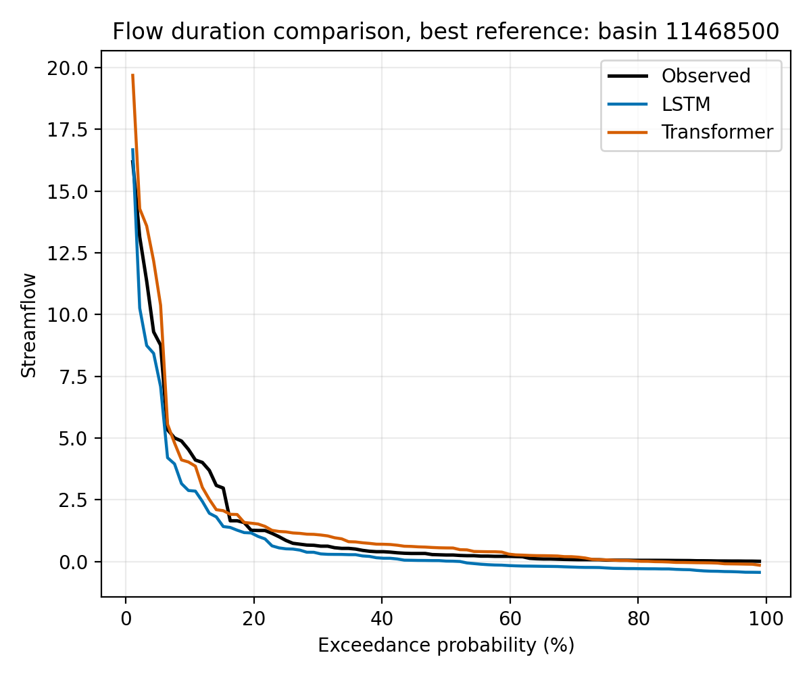
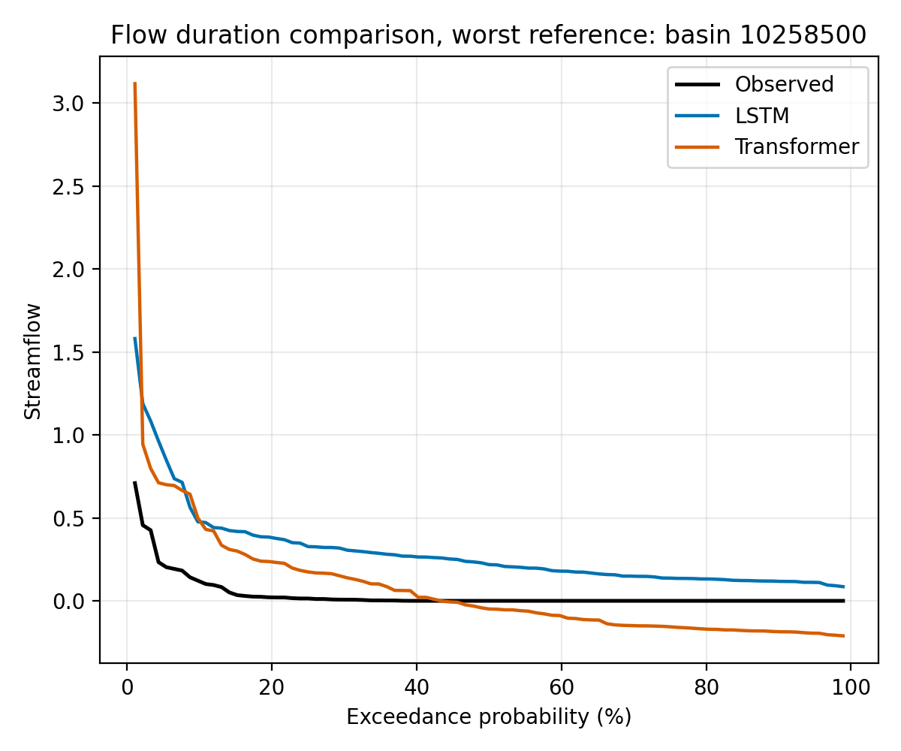

# Problem 4: Evaluation and Interpretation

**Git repository:** https://github.com/mfarmani95/Streamflow_Prediction.git

## Brief Methods Overview

I evaluated two sequence models for held-out basin streamflow prediction: an LSTM and a Transformer. Both models used daily meteorological forcing sequences with static catchment attributes and predicted streamflow at the target time step after each sequence. The split was by basin, so held-out validation and test basins were not used during training. Normalization statistics were fit on training basins and then reused for validation and test data.

- LSTM best run: `outputs/sweeps_mse/seq120_hidden128_batch032_lr0p001`
- LSTM configuration: model=lstm, loss=nse, seq_len=120, window_stride=120, hidden_size=128, num_layers=1, dropout=0.1, batch_size=32, lr=0.001, train_basin_count=30, val_basin_count=10, test_basin_count=10, split_strategy=stratified
- Transformer best run: `output/transformer_MSE_T1/seq120_hidden064_batch128_lr0p001_drop0p2`
- Transformer configuration: model=transformer, loss=mse, seq_len=120, window_stride=120, hidden_size=64, num_layers=2, nhead=4, dim_feedforward=128, dropout=0.2, batch_size=128, lr=0.001, train_basin_count=30, val_basin_count=10, test_basin_count=10, split_strategy=stratified

The current runs use non-overlapping windows because `window_stride` equals `seq_len`. Therefore, the time-series figures show one prediction per non-overlapping sequence target rather than a fully daily rolling prediction.

## Quantitative Test Metrics

| Model | NSE | KGE | RMSE | MAE | MSE |
| --- | --- | --- | --- | --- | --- |
| LSTM | 0.5238 | 0.7593 | 2.1738 | 0.9174 | 4.7254 |
| Transformer | 0.2765 | 0.6265 | 2.6794 | 1.0624 | 7.1789 |

NSE and KGE are hydrology-relevant skill metrics where higher values are better and 1.0 is ideal. RMSE, MAE, and MSE are error metrics where lower values are better.

### KGE Over Catchments

| Model | Median KGE | Fraction KGE < 0 | Fraction KGE >= 0.5 | Fraction KGE >= 0.7 |
| --- | --- | --- | --- | --- |
| LSTM | 0.5448 | 30.0% | 50.0% | 30.0% |
| Transformer | 0.2889 | 40.0% | 40.0% | 20.0% |



The KGE CDF shows the full distribution of catchment skill. A curve shifted to the right indicates that more catchments have higher KGE, not only that the mean score improved.

### Low-Flow and Peak-Flow Metrics

| Model | Regime | NSE | Percent bias | n |
| --- | --- | --- | --- | --- |
| LSTM | low_flow_obs_le_p10 | -9414.0923 | 14885.0% | 88.0000 |
| LSTM | peak_flow_obs_ge_p95 | -0.6044 | -17.2% | 44.0000 |
| Transformer | low_flow_obs_le_p10 | -7940.1909 | 1102.5% | 88.0000 |
| Transformer | peak_flow_obs_ge_p95 | -0.9949 | -13.8% | 44.0000 |



Low flows were defined from the lowest 10% of observed test flows and peak flows from the highest 5% of observed test flows. This separates ordinary error from hydrologically important low-flow and high-flow behavior.

## Requested Plots

### Predicted Versus Observed Scatterplot



### Predicted Versus Observed Time Series





### Basin-Level Model Comparison



### Seasonality



### Flow-Duration Curves





## Best and Poorly Performing Basins

For LSTM, the best basin by NSE was 11468500 (NSE=0.862, KGE=0.616, RMSE=1.062). The poorest basin was 10258500 (NSE=-8.456, KGE=-6.240, RMSE=0.324).

For Transformer, the best basin by NSE was 14308990 (NSE=0.910, KGE=0.761, RMSE=0.677). The poorest basin was 10258500 (NSE=-11.915, KGE=-2.238, RMSE=0.378).

The best basins have hydrographs where the model captures the timing and magnitude of the dominant flow variability. The poorest basins show the opposite: errors in amplitude, weak low-flow behavior, or missed high-flow events can create very negative NSE/KGE even when RMSE is not visually large. This is especially important for basins with low observed variance, because NSE strongly penalizes errors relative to the observed variance.

## Interpretation

Relative to the LSTM, the Transformer had lower overall NSE (delta=-0.247), KGE delta=-0.133, and RMSE delta=0.506. The basin-level comparison is therefore important: overall means can hide whether one model improves many catchments or only a few difficult ones.

LSTM catchment KGE distribution had median KGE=0.545; 30.0% of catchments were below KGE=0, 50.0% were at or above KGE=0.5, and 30.0% were at or above KGE=0.7.

Transformer catchment KGE distribution had median KGE=0.289; 40.0% of catchments were below KGE=0, 40.0% were at or above KGE=0.5, and 20.0% were at or above KGE=0.7.

LSTM had its strongest monthly NSE in month 1 (NSE=0.812) and weakest monthly NSE in month 4 (NSE=-0.092).

Transformer had its strongest monthly NSE in month 10 (NSE=0.722) and weakest monthly NSE in month 4 (NSE=-0.876).

LSTM flow-regime behavior: low flow obs le p10 bias=14885.0% and NSE=-9414.092; middle flow bias=10.2% and NSE=0.225; peak flow obs ge p95 bias=-17.2% and NSE=-0.604.

Transformer flow-regime behavior: low flow obs le p10 bias=1102.5% and NSE=-7940.191; middle flow bias=31.6% and NSE=-0.473; peak flow obs ge p95 bias=-13.8% and NSE=-0.995.

The LSTM imposes a recurrent inductive bias: information is compressed through a hidden state as the sequence is read. This can be helpful for smooth memory of antecedent wetness, but it may struggle when different parts of the input sequence matter unevenly. The Transformer can attend across the full sequence more directly, which may help with long-range meteorological dependencies, but it also has more flexibility and may be more sensitive to small training sets or noisy catchment-specific behavior. The basin-level plots are therefore more informative than a single overall score.

The flow-regime analysis shows whether the models reproduce hydrologically important extremes. Large positive low-flow bias means the model predicts water when observed flow is near zero. Negative peak-flow bias means the model underestimates high-flow events. These errors can come from limited training examples for extremes, non-overlapping sequence sampling, and the difficulty of using basin-averaged static attributes to represent catchment storage, snow, and runoff generation processes.

## Reproduction Commands

Install dependencies and run from the repository root:

```bash
uv venv --python 3.11 .venv
source .venv/bin/activate
uv pip install -r requirements.txt
```

Reproduce the selected LSTM run:

```bash
python main.py train \
  --config configs/default.yaml \
  --model lstm \
  --seq-len 120 \
  --window-stride 120 \
  --hidden-size 128 \
  --num-layers 1 \
  --dropout 0.1 \
  --batch-size 32 \
  --lr 0.001 \
  --loss nse \
  --epochs 50 \
  --seed 42 \
  --split-strategy stratified \
  --split-stratify-attribute aridity \
  --train-basin-count 30 \
  --val-basin-count 10 \
  --test-basin-count 10 \
  --output-dir outputs/reproduce_best_lstm \
  --checkpoint outputs/reproduce_best_lstm/best_model.pt
python main.py evaluate --checkpoint outputs/reproduce_best_lstm/best_model.pt --output-dir outputs/reproduce_best_lstm
python main.py analyze-run --run-dir outputs/reproduce_best_lstm
```

Reproduce the selected Transformer run:

```bash
python main.py train \
  --config configs/transformer_sweep.yaml \
  --model transformer \
  --seq-len 120 \
  --window-stride 120 \
  --hidden-size 64 \
  --num-layers 2 \
  --dropout 0.2 \
  --batch-size 128 \
  --lr 0.001 \
  --loss mse \
  --epochs 100 \
  --seed 42 \
  --split-strategy stratified \
  --split-stratify-attribute aridity \
  --train-basin-count 30 \
  --val-basin-count 10 \
  --test-basin-count 10 \
  --output-dir outputs/reproduce_best_transformer \
  --checkpoint outputs/reproduce_best_transformer/best_model.pt \
  --nhead 4 \
  --dim-feedforward 128
python main.py evaluate --checkpoint outputs/reproduce_best_transformer/best_model.pt --output-dir outputs/reproduce_best_transformer
python main.py analyze-run --run-dir outputs/reproduce_best_transformer
```

Recreate this comparison report:

```bash
python main.py problem4-report --lstm-run-dir outputs/sweeps_mse/seq120_hidden128_batch032_lr0p001 --transformer-run-dir output/transformer_MSE_T1/seq120_hidden064_batch128_lr0p001_drop0p2 --output-dir reports/problem4
```

## Conclusion

The strongest part of the workflow is the basin-held-out evaluation: the test metrics, KGE CDF, basin-level rankings, and flow-regime plots show model behavior beyond a single loss value. The models can capture useful streamflow variability for some basins, but performance is uneven across catchments and hydrologic regimes. The main weaknesses are low-flow bias, peak-flow underestimation, and sensitivity to basin-specific behavior. Future improvements should test denser rolling predictions, more extreme-flow-aware losses or sampling, and additional catchment attributes or process-informed features.
